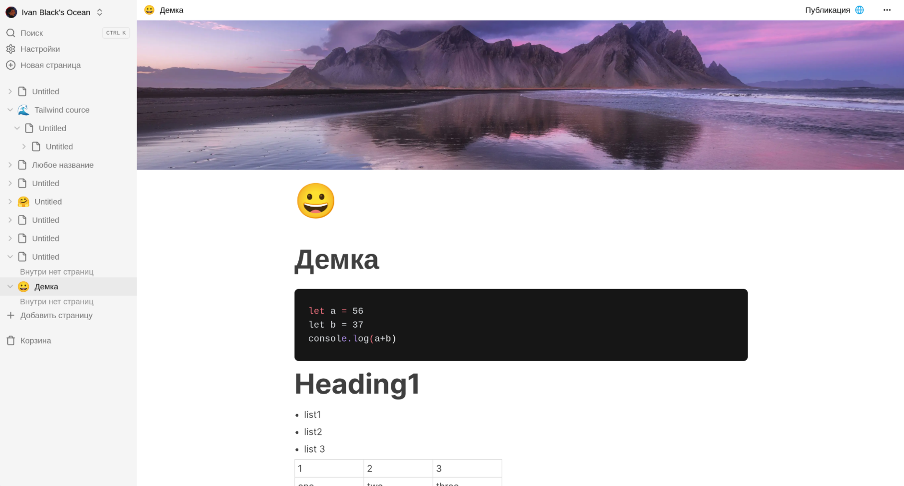
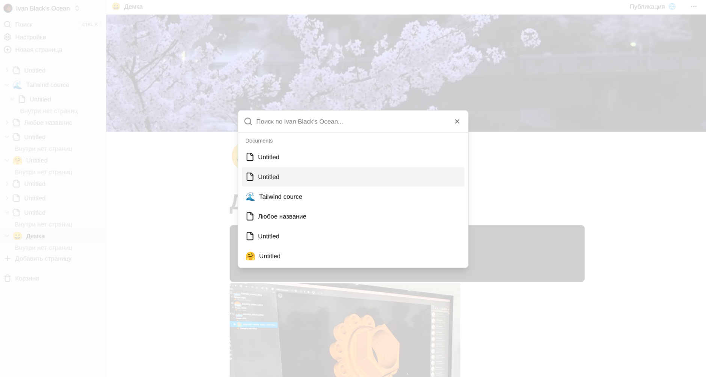
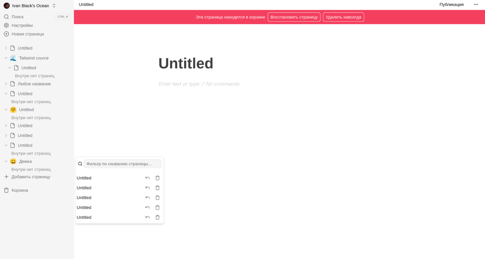
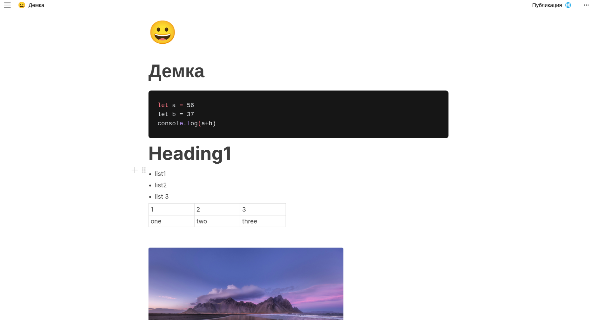

# Ocean

Ocean is a Notion-style document workspace built with Next.js, Convex, Clerk, EdgeStore and BlockNote. The app supports authenticated private documents, nested pages, publishing read-only previews, cover images, icons, search, trash/restore flows and PDF export.

## Screenshots









## Tech Stack

- Next.js App Router with React 19.
- Convex for document data and auth-aware mutations/queries.
- Clerk for authentication.
- EdgeStore for user-uploaded document assets.
- BlockNote for rich text editing.
- Tailwind CSS and shadcn-style Radix primitives for UI.
- ESLint, TypeScript and Prettier for local quality checks.

## Requirements

- Node.js 22.x is recommended. Next.js 16 requires Node.js 20.9 or newer.
- npm 10 or newer.
- A Clerk application.
- A Convex deployment.
- EdgeStore access credentials if image upload is used.

## Environment

Create `.env.local` for local development. Do not commit real secrets.

```bash
NEXT_PUBLIC_CLERK_PUBLISHABLE_KEY=pk_test_...
CLERK_SECRET_KEY=sk_test_...
CONVEX_DEPLOYMENT=dev:your-convex-deployment-name
# Optional. If omitted, next.config.mjs derives it from CONVEX_DEPLOYMENT.
NEXT_PUBLIC_CONVEX_URL=https://your-convex-deployment-name.convex.cloud
EDGE_STORE_ACCESS_KEY=...
EDGE_STORE_SECRET_KEY=...
```

`NEXT_PUBLIC_CONVEX_URL` is the preferred production variable. For local compatibility this repo also accepts `CONVEX_DEPLOYMENT` and derives `https://<deployment>.convex.cloud` from the part after `:`.

## Local Setup

Install dependencies:

```bash
npm install
```

Run the development server:

```bash
npm run dev
```

Open http://localhost:3000.

If Convex schema or functions change, run Convex locally in a separate terminal according to your Convex project setup:

```bash
npx convex dev
```

## Scripts

```bash
npm run dev           # Start Next.js dev server
npm run build         # Production build
npm run start         # Start production server after build
npm run lint          # ESLint 9 flat-config lint
npm run typecheck     # TypeScript check without emit
npm run format        # Format with Prettier
npm run format:check  # Verify Prettier formatting
npm audit             # Dependency vulnerability report
```

## Docker

The Dockerfile is a multi-stage build:

1. `deps` installs full dependencies for build.
2. `prod-deps` installs production dependencies only.
3. `builder` runs `npm run build`.
4. `runner` starts the built Next.js app as a non-root user.

Build the image with public build-time variables:

```bash
docker build \
  --build-arg NEXT_PUBLIC_CLERK_PUBLISHABLE_KEY="$NEXT_PUBLIC_CLERK_PUBLISHABLE_KEY" \
  --build-arg CONVEX_DEPLOYMENT="$CONVEX_DEPLOYMENT" \
  --build-arg NEXT_PUBLIC_CONVEX_URL="$NEXT_PUBLIC_CONVEX_URL" \
  -t ocean:local .
```

Run it:

```bash
docker run --rm -p 3000:3000 \
  -e NEXT_PUBLIC_CLERK_PUBLISHABLE_KEY="$NEXT_PUBLIC_CLERK_PUBLISHABLE_KEY" \
  -e NEXT_PUBLIC_CONVEX_URL="$NEXT_PUBLIC_CONVEX_URL" \
  -e CLERK_SECRET_KEY="$CLERK_SECRET_KEY" \
  -e EDGE_STORE_ACCESS_KEY="$EDGE_STORE_ACCESS_KEY" \
  -e EDGE_STORE_SECRET_KEY="$EDGE_STORE_SECRET_KEY" \
  ocean:local
```

Public `NEXT_PUBLIC_*` values are baked into the client bundle at build time. Rebuild the image when those values change.

## Quality Checklist

Before opening a PR or merging a task branch, run:

```bash
npm run format:check
npm run lint
npm run typecheck
npm run build
npm audit --audit-level=moderate
```

## Notes

- `/` and `/login`-style Clerk entry points are public. `/documents/*` requires an authenticated Clerk session.
- Published previews are served under `/preview/[documentId]` and remain read-only.
- Raw `.env` files are ignored by Git and Docker context to avoid leaking secrets.
- `screenshots/` is documentation-only and intentionally excluded from Docker builds.
